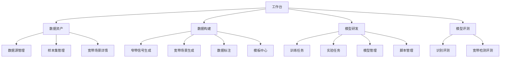
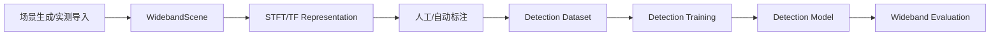
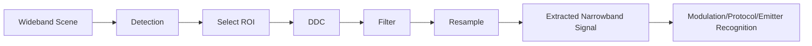

# V2 信息架构与业务链

## 1. 顶层信息架构

## 2. 宽带业务主链

## 3. 宽窄带联动链

## 4. 页面导航规则

- “宽带场景详情”中的任一 detection/annotation 可进入“提取信号”。
- “提取信号”完成后进入“窄带信号详情”。
- 窄带详情必须显示来源 Scene 和 ROI，可一键返回。
- Detection Dataset 详情必须可追溯 TF/STFT 参数和原始 Scene。
- Model 详情必须可追溯 Training Experiment 和 Dataset Version。
- Evaluation 详情必须可追溯 Model Version 和 Dataset Version。
